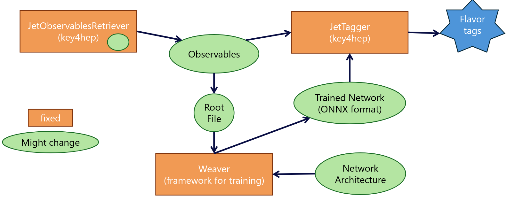

# Key4Hep Jet-Flavor Tagging Implementation for CLD Full Simulation using Machine Learning

This repository is an implementation of ML-based jet-flavor tagging for full simulation using the key4hep framework.

The default tagger in this repo is trained on
- CLD full simulation (CLD_o2_v05)
- $\sqrt{s} = 240$ GeV
- $Z(\nu \nu)H(jj)$ events

The tagger distinguishes seven flavors ($H\rightarrow u \bar{u}$, $H\rightarrow d \bar{d}$, $H\rightarrow c \bar{c}$, $H\rightarrow s \bar{s}$, $H\rightarrow b \bar{b}$, $H\rightarrow g g$, $H\rightarrow \tau^- \tau^+$) and returns a probability for every flavor per jet.

## Technical implementation

We build a Gaudi Transformer `JetTagger` (in `k4MLJetTagger/k4MLJetTagger/src/components/JetTagger.cpp`) that works as follows:
1. First, it extracts jet constituent variables (such as kinematics, track parameters, PID...) from every jet in the event with `JetObservablesRetriever`.
2. Then, it uses these variables as input to a neural network ([Particle Transformer](https://arxiv.org/abs/2202.03772)). Here, we run inference on an [ONNX](https://onnx.ai/) exported trained network on 2 million jets/flavor using [weaver](https://github.com/hqucms/weaver-core). The code is in `WeaverInterface` and `ONNXRuntime`.
3. Create $N$ (here: 7) new collections `RefinedJetTag_X` that saves the probability for each flavor.

This code base also allows you to
- extract the MC jet flavor **assuming H(jj)Z(vv)** events by checking the PDG of the daughter particles of the Higgs Boson created. This is also implemented as a Gaudi Transformer `JetMCTagger`.
- write the jet constituent observables used for tagging into a root file (e.g., for retraining a model) using `JetObsWriter` that accesses the observables retrieved in `JetObservablesRetriever`.
- write the jet tags (MC and reco) into a root file (e.g., to create ROC curves) using `JetTagWriter`.


## Dependencies

* ROOT

* PODIO

* Gaudi

* k4FWCore

## Installation

**Local installation**

Clone this repository.

Within the `k4MLJetTagger` directory run:

``` bash
cd /your/path/to/this/repo/k4MLJetTagger/
source ./setup.sh
k4_local_repo
mkdir build
cd build
cmake .. -DCMAKE_INSTALL_PREFIX=../install -G Ninja -DPython_EXECUTABLE=$(which python3)
ninja install
```

**Using the official software stack**

The `k4MLJetTagger` is available on the nightlies (since April 2025).

```
source /cvmfs/sw-nightlies.hsf.org/key4hep/setup.sh
```

## Execution

Run the tagger by including the transformer `JetTagger` in a steering file like `createJetTags.py` and run it like this:

``` bash
k4run ../k4MLJetTagger/options/createJetTags.py --num_ev 20
```

This will return your edm4hep input file with the added `RefinedJetTag_X` collections.

Soon, the `k4MLJetTagger` will be part of the CLD reconstruction chain by adding the flag `--enableMLJetTagger`, see [this pull request](https://github.com/key4hep/CLDConfig/pull/75).

## Infomation about the steering files provided

There are four steering files provided in this repo in `/k4MLJetTagger/k4MLJetTagger/options/`. They either start with `create`, which refers to a steering file that will append a new collection to the input edm4hep files provided, or they start with `write` and only produce root files as an output.

- `createJetTags.py`: tags every jet using ML and appends 7 new PID collections `RefinedJetTag_X` with `X` being the 7 flavors (U, D, S, C, B, G, TAU).
- `createJetMCTag.py`: appends one PID collection, `MCJetTag` that refers to the MC jet flavor. **Warning**: This **assumes H(jj)Z(vv)** events as it checks the PDG of the daughter particles of the Higgs Boson in the event.
- `writeJetConstObs.py`: creates a root file with jet constituent observables that can be used to train a model or plot the input parameters to the network for insights about the data.
- `writeJetTags.py`: creates a root file with reco and MC jet tags that can be used to create ROC curves.

## For Analysers: How to use the JetTagger output

If you want to use the Jet Tagger for your analyses, you most likely only need to use a setup like in the steering file `createJetTags.py`, which includes the tagger in your steering file. As being said, this will attach 7 new PID collections to your edm4hep input file. You can then access the PID collections with a [PIDHandler](https://edm4hep.web.cern.ch/md_doc_2_p_i_d_handler.html) like being done in `JetTagWriter` (check it out).

Every jet has *one* PID collection for *every flavor*. Each jet has a certain probability associated for being of each flavor. E.g., if you want to use all jets that have at least a probability $X$ being of flavor $b$, then you could write something like:

```
#include <edm4hep/ParticleIDCollection.h>
#include <edm4hep/utils/ParticleIDUtils.h>

// jet_coll is the "RefinedJetTags" collection
// jetTag_B_Handler is a PIDHandler, e.g. like 
// auto jetTag_B_Handler = edm4hep::utils::PIDHandler::from(reco_jettag_B_coll); // with reco_jettag_B_coll being the "RefinedJetTag_B" collection 

// loop over all jets and get the PID likelihood of being a b-jet
for (const auto jet : jet_coll) {
 auto jetTags_B = jetTag_B_Handler.getPIDs(jet);
 score_recojet_isB = jetTags_B[0].getLikelihood(); // [0] because there should only be ONE b-tag PID collection associated to one jet
 if(score_recojet_isB > X){
 // your code here
 }
}
```

For an working example code, see `MLJetTagger/k4MLJetTagger/src/components/JetTagWriter.cpp` and `JetTagWriter.h`. 

If you want to use the jet-tag collections in [FCCAnalyses](https://github.com/HEP-FCC/FCCAnalyses), use the `master` branch to evaluate full simulation samples. Make sure that the `k4MLJetTagger` has been applied to the data (inspect available collections from your input edm4hep root files with `podio-dump myfiles.root`. You should see the `RefindedJetTag_X` collections. If not, you need to run the tagger over the data first. Use a steeringfile like `createJetTags.py` for this.) Here is an example function to retrieve b-jet scores: 

```
Vec_f get_bscores(ROOT::VecOps::RVec<edm4hep::ParticleIDData> b_tags_coll) {
    // check size of the b-tag collection - must be 2
    if(b_tags_coll.size() != 2) {
        std::cout << "ERROR: Expected two b-tag collections! " << std::endl;
        exit(1);
    }

    Vec_f result;
    result.reserve(2); // two b scores 

    for (const auto b_tags : b_tags_coll) {
        // std::cout << "jet likelihood: " << b_tags.likelihood << std::endl;
        // std::cout << "jet pdg: " << b_tags.PDG << std::endl;
        result.emplace_back(b_tags.likelihood);
    }

    return result;
}
```

## Information about the source files

Here is a quick overview of the source files in this repo:

*Gaudi Transformer:*
- `JetTagger.cpp`: Gaudi Transformer to attach jet tags (7) as PID collections to the input edm4hep file
- `JetMCTagger.cpp`: Gaudi Transformer to attach jet MC tag as PID collection to the input edm4hep file
*Gaudi Algorithms:*
- `JetTagWriter`: Gaudi Algorithm to write reco and MC jet tags into a root file
- `JetObsWriter`: Gaudi Algorithm to write jet constituent observables into a root file
*Other C++ Helpers*:
- `JetObservablesRetriever`: Defines a class to retrieve jet constituent observables from the jet collection and vertex collection.
- `ONNXRuntime`: Interacts with ONNX model for inference.
- `WeaverInterface`: Wrapper around ONNXRuntime to match the expected format from training the network with `weaver`.
- `Structs.h`: Defines the structs `Pfcand` for saving information about the jet constituents, the struct `Helix` for saving track parameters, and the struct `Jet`, which is a vector of `Pfcand`.
- `Helpers`: Other helpers

## Retraining a model

### When do I need to train a new model and exchange it here?
- If you want to run at a different energy.
- If you want to use different input observables for tagging (check out [this section](#adding-new-input-observables-for-tagging)).
- If you want to use a different detector setup.
- If you have different kinematics than $H(qq)Z(\nu \nu)$. 

So, generally speaking, if the input to the network changes. *This* network implemented was trained on CLD full simulation at 240 GeV (`/eos/experiment/fcc/prod/fcc/ee/test_spring2024/240gev/Hbb/CLD_o2_v05/rec/`). Check out the performance in this [publication](https://repository.cern/records/4pcr6-r0d06).

### How to retrain a model



0. Do some changes that require retraining.
1. Create a dataset to train the model on. The data should be stored in a root file, and you can use the `JetObsWriter` to create them. You normally need ~1-2 mio jets/flavor to train a new model; that is why I recommend creating the root file using condor. Follow the instructions [here](#creating-training-or-test-data) and resources [here](#extra-section) to do so.
2. I recommend using [weaver](https://github.com/doloresgarcia/weaver-core) to retrain a model and to make use of Dolores implementation of the ParticleTransformer using her repository/version of weaver. The branch `Saras-dev` also has the implementation of the L-GATr network, which does not outperform the ParticleTransformer, however. Here is how to set up the training with weaver:
- Clone [weaver](https://github.com/doloresgarcia/weaver-core).
- Clone your choice of network e.g., the [ParT](https://github.com/jet-universe/particle_transformer).
- Set up the environment using a docker. First, create the `.sif` file with `singularity pull docker://dologarcia/colorsinglet:v4` (or `singularity pull docker://dologarcia/gatr:v0` for L-GATr, this docker only has some add-ons compared to the colorsinglet, so it also works for the ParT). You only need to do this once. Then export the cache with `export APPTAINER_CACHEDIR=/your/path/to/cache`. You can then activate the env with `singularity shell -B /your/bindings/ --nv colorsinglet.sif `. Bindings could be `-B /eos -B /afs` if running on CERN resources.
- Create a `.yaml` file to specify how to train the network. To use the jet observable convention used here, I have created a dummy config file in the `extras` section: `config_for_weaver_training.yaml`. Please check out the [open issues](#open-problems--further-work) to adapt the convention in the source code, but I *highly recommend* using the convention used in key4hep / here / in the dummy config when retraining the model and make the changes in the source code.
- Create a [wandb](https://wandb.ai/) account. You need to connect your docker env *once* with your wandb account: Activate your env with `singularity shell -B /your/bindings/ --nv colorsinglet.sif ` and then do `wandb login`.

3. Run the training

- Go to a machine of your choice with at least one GPU. The code below shows how to run on 4 GPUs.
- (Optional: Export your cache directory and) Activate your env with `singularity  shell -B /your/bindings/ --nv colorsinglet.sif `
- Go to `/path/to/weaver-core/`
- Run the following command:

```
torchrun --standalone --nnodes=1 --nproc_per_node=4 /your/path/to/weaver-core/weaver/train.py \
--data-train /your/path/to/data/*.root \
--data-config /your/path/to/configs/config_for_weaver_training.yaml \
--network-config /your/path/to/particle_transformer/networks/example_ParticleTransformer.py \
--model-prefix /your/path/to/model_weights/mykey4hepmodel/ \
--num-workers 0 --gpus 0,1,2,3 \
--batch-size 2048 --start-lr 1e-3 --num-epochs 60 \
--optimizer ranger --fetch-step 0.01 \
--log-wandb --wandb-displayname myfirsttraining \
--wandb-projectname FCC-tagging-with-key4hep \
--lr-scheduler reduceplateau --backend nccl
```

The `--nproc_per_node=4` specifies that you have 4 GPUs and `--gpus 0,1,2,3` which ones you would like to use. For every training on a different dataset, create a *new* config file and use the `.auto.yaml` created by weaver to run inference later. Create a folder where to store the model weights `--model-prefix /your/path/to/model_weights/mykey4hepmodel/`. You can load model weights by adding `--load-model-weights /your/path/to/model_weights/old_training/_epoch-X_state.pt \` to the command with `X` being the epoch you want to load. To find out more, check out the [wiki](https://github.com/doloresgarcia/weaver-core/wiki/Training).

4. Once satisfied with the training, you should have your model weights saved like `/your/path/to/model_weights/mykey4hepmodel/_best_epoch_state.pt`.
5. Optional: You can also run inference using weaver. Please use data other than what you used for training to run inference. Use the auto-generated config file from training to run the inference. You can use the code provided in `extras/plotting` to check if your `results.root` file matches the performances expected.

```
python3 -m weaver.train --predict --data-test /your/path/to/test-data/*.root \
--data-config your/path/to/configs/config_for_weaver_training.248dcd877468b36a361a73654bb4e913.auto.yaml \
--network-config /your/path/to/particle_transformer/networks/example_ParticleTransformer.py \
--model-prefix /your/path/to/model_weights/mykey4hepmodel/_best_epoch_state.pt \
--gpus 0 --batch-size 64 \
--predict-output /your/path/to/mykey4heptagging/results.root
```

6. Export your `.pt` model to ONNX. Follow [these instructions](#changing-the-inference-model---exporting-the-model-to-onnx).
7. Check if you need to do adjustments on the source code. Follow [these instructions](#changing-the-inference-model---adjusting-the-code).
8. Run inference and check the performance. Help yourself using the scripts in `extras/plotting`.
9. Be proud of yourself. Well done :)

### Creating training or test data

(For offical data creation, plese use the offical CLD reconstruction chain. You can use the flag `--enableMLJetTagger` during the reconstruction step, see [documentation](https://fcc-ee-detector-full-sim.docs.cern.ch/CLD/) and [implementation to CLDConfig](https://github.com/key4hep/CLDConfig/pull/75))

In the `extra` section, you will find helper files to *privatly* produce large datasets for either training or evaluating the jet tagger. We use [condor](https://batchdocs.web.cern.ch/local/quick.html) to produce large dataset in root format. The folder `submit_to_condor` has two files:


- `write_sub.py`: Modify this file to your needs.
  - (`input_data_path`, `data_pattern`), First, you need to define your input data. You will likely use files from the [central production](https://fcc-physics-events.web.cern.ch/fcc-ee/full-sim/index.php). Every production has its own production tag (number) that you need to set too. Please remember, the data should contain jets you want to train on / or test the taggers performance on.
  - (`num_files`, `num_files_per_job`) Set the total number of files you want to process and the number of files per job.
  - (`output_base`, `output_log`) Set a folder where you want to store the produced data (probably somewhere on `eos`). Also define a path where the condor log files should be saved (probably somewhere on your `afs`). The log files are useful to debug the condor job if needed.
  - (`job`) Decide what job you want to submit on condor! In principle, this can be any steering file for `k4un` that takes input and output files as argument. But most likely you want to use
    - `writeJetConstObs.py`: to write a root file with the jet constituent observables that the jet flavor tagger takes as input. Therefore, use this if you want to **create data to train on**.
    - `writeJetTags.py`: to write a root file with the jet tags. This runs the inference of the tagger on your input data and saves the tags as a root file. With this you can **evaluate the performance of the tagger**. (Have a look at this the notebook `extras/plotting/rocs_compaison.ipynb` to see how to create ROC curves).
  - (`local_path_to_tagger`) Define the path to your local clone of the tagger so you can use the `k4MLJetTagger/options/writeJetConstObs.py` or `k4MLJetTagger/options/writeJetTags.py` steering file. If you created your own steering file, save it in this folder: `k4MLJetTagger/options`.
  - (`local`) Boolean; choose if you want to use the `k4MLJetTagger` from the stack (e.g. you don't have the tagger locally compiled) or if you want to use your locally compiled tagger.
  - (`acounting_group`, `job_flavour`) Last you can set your accounting group for condor and the so called job flavor, e.g. how long your jobs will take.

- `sumbitJob.sh`: This is the file running your job. Do not modify it! (Only in case you created your own steering file that needs more custom options.)

Now that you have modifed the `write_sub.py` file to your needs, you are ready to create the data. First run the `write_sub.py` with a python command so you create a `ccondor.sub` file which will speficy your condor job. Run following commands:

```
# go on lxplus
cd /path/to/k4MLJetTagger/extras/submit_to_condor/
# MODIFY write_sub.py
python3 write_sub.py
# check if condor.sub looks ok

condor_submit condor.sub
```

For more information about how to check your submitted job and condor in general, see the documention [here](https://batchdocs.web.cern.ch/local/quick.html).


### Changing the inference model - exporting the model to ONNX

If you wish to use a different model for tagging, you will need to export the trained model to [ONNX](https://onnx.ai/). Here, we describe how to transform a model with [weaver](https://github.com/hqucms/weaver-core) from `.pt` to `.onnx`.

To export your favorite model `best_model.pt` (e.g. [Particle Transformer](https://arxiv.org/abs/2202.03772)) using `weaver` to onnx, run:

```bash
python3 -m weaver.train \
-c myConfigFromTraining.auto.yaml \
-n /path-to/particle_transformer/networks/example_ParticleTransformer.py \
-m /path-to/best_model.pt \
--export-onnx my-onnx-model.onnx
```

For that, we need an appropriate environment, as the one provided by `weaver` does not work for the conversion to ONNX. The environment can be set-up with the YAML file in `extras` folder like:

```bash
conda env create -f env_for_onnx.yml
conda activate weaver
```

`torch_geometric` is still not supported by this environment (not needed for using Particle Transformer, but e.g. for L-GATr).

### Changing the inference model - adjusting the code

- you need to change the paths to the model and its JSON config file in the steering file (here: `k4MLJetTagger/k4MLJetTagger/options/createJetTags.py`) by setting `model_path` and `json_path` in the `JetTagger` transformer initialization.
- You should not need to change anything apart from the steering file, assuming:
    - You adopted the `flavor_collection_names` in the steering file `createJetTags.py` matching the **order, label, and size** that the network expects. E.g., if the network expects the first output to represent the probability of a $b$-jet, then the first item in the list `flavor_collection_names` needs to be `yourCollectionName_B`. If your network distinguishes between $n$ flavors, make sure to provide $n$ collection names.
    - You used weaver to train your model. (If not, you need to adapt a lot. Start building your own `WeaverInterface` header and source file, adopt the way the Struct `Jet` is transformed to fit the input formatted expected by your network (here done in `Helpers` with this function: `from_Jet_to_onnx_input`) and change the handling of the `json` config file if needed, including the extraction of all necessary inputs in the `tagger` function in `JetTagger.cpp`)
    - the `output_names` of the model in the JSON config file have the format `yourname_isX`. If this changes (e.g. to `_X`), you need to adopt the `check_flavors` function and the `to_PDGflavor` map in `Helpers`.
    - The naming of the input observables follows the FCCAnalyses convention. (As I don't like it, I use my own. Therefore, I have written a `VarMapper` class in `Helpers` that converts into my own key4hep convention. If you work with other conventions, just update the `VarMapper`). I hope that in the future, people will adopt my convention for training the network, too, and then `VarMapper` will not be needed anymore. Read [this section](#open-problems--further-work) to find out how to adopt the code.
    - You use the same (or less) input parameter to the network. In case you want to extract more, have a look at `JetObservablesRetriever` and modify the `Pfcand` Struct in `Structs.h`

### Adding new input observables for tagging

- Extract the wanted parameter in `JetObservablesRetriever` and modify the `Pfcand` Struct in `Structs.h` by adding the new observables as an attribute.
- Modify `JetObsWriter` and add your new observable to be saved in the output root file.
- Retrieve a root file (default `jetconst_obs.root`) by running `k4run ../k4MLJetTagger/options/writeJetConstObs.py` which uses the `JetObsWriter`. To create larger data, submit the jobs to condor (see `extras/submit_to_condor`) explained [here](#extra-section).
- Use the root output (`jetconst_obs.root`, or to be more precise, the root files from your condor submission because you need plenty of data to retrain a model) to _retrain the model_.
- Convert your trained model to ONNX as explained [above](#changing-the-inference-model---exporting-the-model-to-onnx).


## Extra section

You may find helpful resources in the `extras` folder.

- *Creation of a conda env for onnx export*: To export a model trained with weaver, you need an appropriate environment. You can set it up with `env_for_onnx.yml`. See [this section](#changing-the-inference-model---exporting-the-model-to-onnx).

- *Example weaver config file*: The `config_for_weaver_training.yaml` is an example config file to be used for training a network with weaver using the key4hep convention for jet constituent observables names.

- *Submitting jobs to condor*: Helpers to run steering files on large datasets e.g. to create your private training dataset. See instructions [here](#creating-training-or-test-data).

- *Plots*: You can find some plotting scripts in `extras/plotting`:
    - `jetobs_comparison.ipynb` is a notebook that plots the distribution of jet constituent observables used for tagging retrieved with a steering file like `writeJetConstObs.py` that uses the Gaudi algorithm `JetObsWriter`. The notebook compares the distributions of two jet observables from different root files. The helper functions for this notebook are defined in `helper_jetobs.py`
    - `rocs_comparison.ipynb` is a notebook that compares two ROC curves for different flavors. The data used for the ROCs should come from two root files retrieved with a steering file like `writeJetTags.py` that uses the Gaudi algorithm `JetTagsWriter`. The helper functions for this notebook are defined in `helper_rocs.py`. If you don't like Jupyter Notebooks and just want to save the plots use `save_rocs.py` and adopt the path where you want to save the plots in `helper_rocs.py`


## Open problems / further work
- The magnetic field $B$ of the detector is needed at one point to calculate the helix parameters of the tracks with respect to the primary vertex. The magnetic field is hard coded at the moment. It would be possible to retrieve it from the detector geometry (code already added; see the `Helper` file), but therefore, one must load the detector in the steering file, e.g. like [this](https://github.com/key4hep/CLDConfig/blob/ae99dbed8e34390036e29ca09897dc0ed7759030/CLDConfig/CLDReconstruction.py#L61-L66). As we use the v05 version of CLD at the moment, loading the detector is slow and not worth it to only set $Bz=2.0$ (in my opinion). With a newer detector version (e.g. v07) this might be worth investigating.
- Currently, the network used was trained using the [FCCAnalyses convention](https://github.com/HEP-FCC/FCCAnalyses/blob/fa672d4326bcf2f43252d3554a138b53dcba15a4/examples/FCCee/weaver/config.py#L31) for naming the jet constituents observables. The naming is quite confusing; this is why I used my own convention that matches the [key4hep convention](https://github.com/key4hep/EDM4hep/blob/997ab32b886899253c9bc61adea9a21b57bc5a21/edm4hep.yaml#L195-L199). The class `VarMapper` in `Helpers` helps to switch between the two conventions. In the future, if retraining a model, I highly suggest switching to the convention used here when training the model to get rid of the FCCAnalyses convention. To do so, train the network with a yaml file like `extras/config_for_weaver_training.yaml` and root files created with `writeJetConstObs.py`, which use the key4hep convention. To run inference here in key4hep, you only need to modify the function `from_Jet_to_onnx_input` in `Helpers` where the `VarMapper` is used. Remove it; there should be no need to convert conventions anymore. You can then savely delete the `VarMapper` in `Helpers`. 
- A correct primary vertex reconstruction is crucial for a good tagging performance due to the displacement parameters (wrt the PV) being one of the main discriminators in tagging. Unfortunately, the PV fit is not optimal in CLD full simulation, see [this github issue](https://github.com/key4hep/CLDConfig/issues/61). There is an [open issue](https://github.com/key4hep/k4MLJetTagger/issues/7) in this repository too with an attached pdf that will give an introduction to the issue. This is most likely an own project :) 
- It would be very useful to use the tagger on-the-fly in [FCCAnalyses](https://github.com/HEP-FCC/FCCAnalyses) instead of applying the jet-clustering and tagging in the CLD reconstruction step with [CLDConfig](https://github.com/key4hep/CLDConfig/pull/75) because every analysis might have specifics. It would be a waste of resources to create new data for every analysis. In fast simulation with IDEA in [FCCAnalyses](https://github.com/HEP-FCC/FCCAnalyses/tree/master/addons/ONNXRuntime), tagging is done on the fly, maybe this can be starting point. There, the tagger input is retrieved in FCCAnalyses - but this code already exists within the `k4MLTagger`. How can these two tools be merged?


### Outlook

What might be done in the future with the k4MLJetTagger?
- Once improvments of crucial bottlesnecks in other eares of the reconstruction are improved, I would suggest retraining the network. This could be: PV fit fix (see [issue](https://github.com/key4hep/k4MLJetTagger/issues/7)), a new tracking algorithm or fixes in the pandora particle flow (very important!! This is discussed in the paper cited [below](#citation)).
- You might think of training the tagger on different physics events or cross-checking at least the performance (e.g. $e^+ e^- \rightarrow Z(qq) Z( \nu \nu)$ ). Maybe training an other tagger at 365~GeV. 
- In the future, new (and better) architectures than the ParT might be available. You could train and test the tagging performance on such architectures. 
- You might think of including other (informative) jet observables as an input to the tagger. Maybe newer detector geometries will have other observables available. 


## Further links:

- [ONNX implemention in FCCAnalyses](https://github.com/HEP-FCC/FCCAnalyses/tree/master/addons/ONNXRuntime): Strongly inspired this code.
- [k4-project-template](https://github.com/key4hep/k4-project-template)

## Citation

If you find this code helpful and use it in your research, please cite:

```
@manual{aumiller_2024_4pcr6-r0d06,
  title        = {Jet Flavor Tagging Performance at FCC-ee},
  author       = {Aumiller, Sara and
                  Garcia, Dolores and
                  Selvaggi, Michele},
  month        = nov,
  year         = 2024,
  doi          = {10.17181/4pcr6-r0d06},
  url          = {https://doi.org/10.17181/4pcr6-r0d06}
}
```

The performance of this jet-tagger is discussed in Section 4.1
